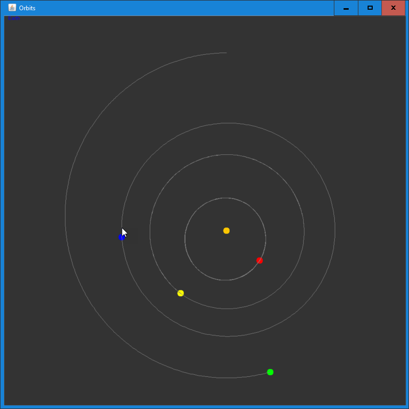

# Solar System

### Inner solar system planets orbiting the Sun.

The solver uses classical Newtonian mechanics.

# Download 

Get the JAR file under [Actions](https://github.com/haphaeu/SolarSystem/actions)

# Project Status

